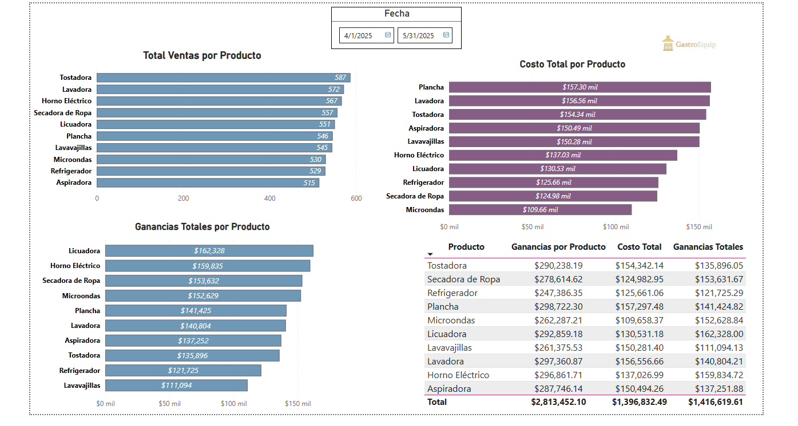
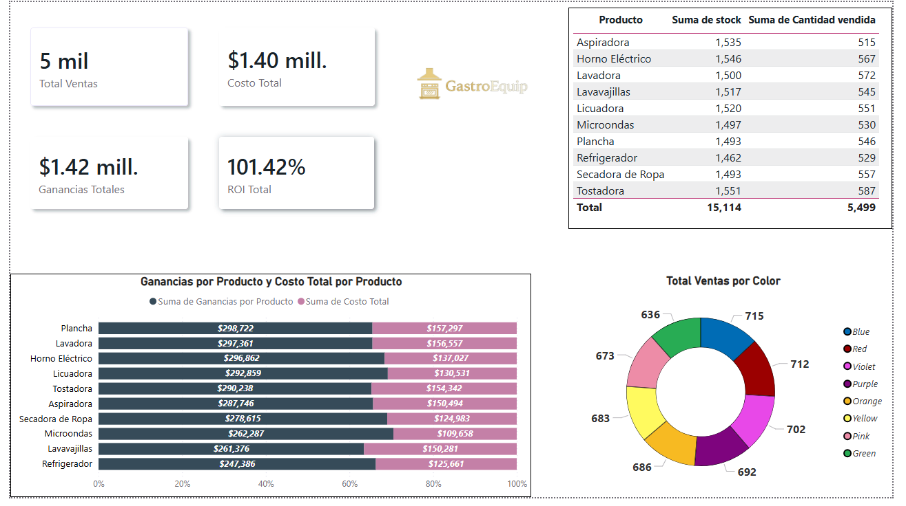

# 📊 Global Sales Performance Dashboard

An interactive Business Intelligence solution developed to analyze international sales trends, regional profitability, and product performance.

## 🖼️ Dashboard Preview

*Figure 1: Executive summary showing revenue trends, total profit, and global KPIs.*

*Figure 2: Regional analysis highlighting market distribution and segment profitability.*

## 🚀 Core Features
- **Trend Analysis:** Real-time monitoring of sales and profit growth over time using area charts.
- **Geographic Insights:** Interactive map visuals to evaluate market performance across key regions.
- **Product Strategy:** Identification of top-selling products and profit margins per category.
- **Dynamic Filtering:** Integrated slicers for Countries, Segments, and Timeframes.

## 🛠️ Technical Stack
- **Power BI Desktop:** Core dashboard design and UI/UX development.
- **Power Query:** ETL processes for data cleaning and transformation.
- **DAX (Data Analysis Expressions):** Custom measures for Total Sales and Profit Margins.

## 📂 Project Documentation
- **Full Analysis Report:** [View Project Report (PDF)](./Proyect_Jordan%20Araya_Business%20Analytics.pdf)
- **Power BI Source File:** [Download .pbix File](./Proyecto%20Jordan%20Araya.pbix)

---
## 🧠 Business Insights
This project demonstrates the ability to transform raw financial data into actionable business strategies, identifying growth opportunities in international markets.
